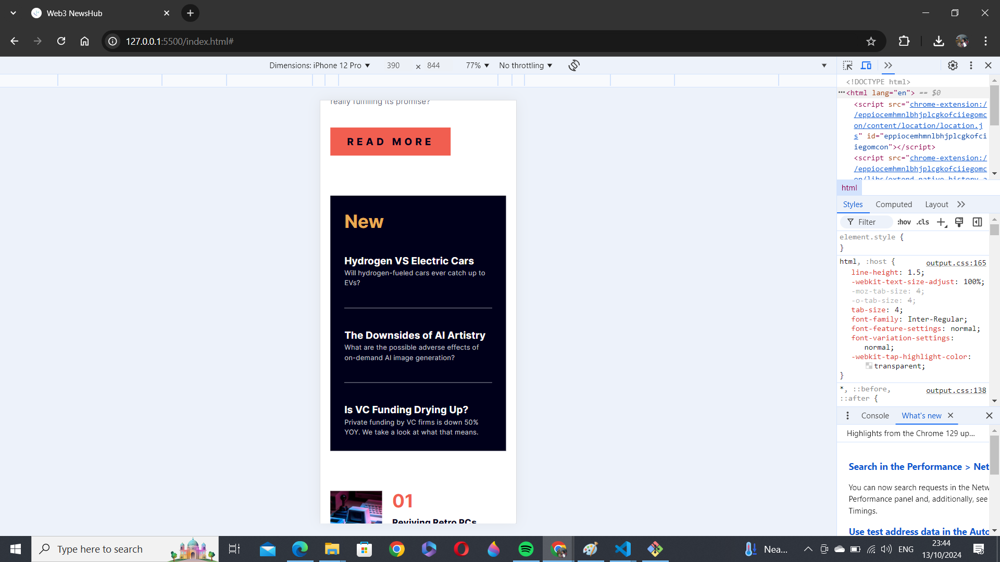

# Frontend Mentor - News homepage solution

This is a solution to the [News homepage challenge on Frontend Mentor](https://www.frontendmentor.io/challenges/news-homepage-H6SWTa1MFl). Frontend Mentor challenges help you improve your coding skills by building realistic projects.

## Table of contents

- [Overview](#overview)
  - [The challenge](#the-challenge)
  - [Screenshot](#screenshot)
  - [Links](#links)
- [My process](#my-process)
  - [Built with](#built-with)
  - [What I learned](#what-i-learned)
  - [Continued development](#continued-development)
  - [Useful resources](#useful-resources)
- [Author](#author)
- [Acknowledgments](#acknowledgments)

**Note: Delete this note and update the table of contents based on what sections you keep.**

## Overview

### The challenge

Users should be able to:

- View the optimal layout for the interface depending on their device's screen size
- See hover and focus states for all interactive elements on the page

### Screenshot





### Links

- Solution URL: [Add solution URL here](https://your-solution-url.com)
- Live Site URL: [Add live site URL here](https://your-live-site-url.com)

## My process

### Built with

- Semantic HTML5 markup
- CSS custom properties
- Flexbox
- CSS Grid
- Mobile-first workflow
- [TailwindCSS](https://tailwindcss.com/) - PostCSS library

### What I learned

So this is the first project I'm attempting with tailwindcss. I experienced some challenges while using the PlayCDN method but through series of Youtube videos, I got the hang of using the Tailwind CLI

I'm especially proud of this js script I wrote, there's probably better ways to execute the onclick function for the hamburger menu but I'm proud mine works

```js
const burgerBtn = document.querySelector("#burger");
const menuBar = document.querySelector("#menu");
const closeBtn = document.querySelector("#close");

burger.addEventListener("click", () => {
  menuBar.classList.add("flex");
  menuBar.classList.remove("hidden");
});

closeBtn.addEventListener("click", () => {
  menuBar.classList.add("hidden");
  menuBar.classList.remove("flex");
});
```

### Continued development

There's still a long way to go from here for me but some of the skills I have to get really acquainted with before the year ends are

- Tailwind CSS
- JavaScript
- Arduino
- React
- Next.js
- Node.js
- Python
- SQL
- Rust.js

The list is practically inexhaustible but I rely on the help of God

### Useful resources

- [Net Ninja on YouTube](https://www.youtube.com/@NetNinja) - This helped me understand TailwindCSS. I really liked his language, rate of speech and the genereal code-along experience. I will definitely recommend him for anyone who wants to get started on whatever language

- [Tailwind CSS Website](https://tailwindcss.com/docs/) - The Tailwind documentation also helped me in my journey as I checked there countless times for available presets. I'd recommend it to anyone still learning this concept, its a no-brainer.

## Author

- Website - [Stallion](https://linktr.ee/thathorserep)
- Frontend Mentor - [@ThatHorseRep](https://www.frontendmentor.io/profile/ThatHorseRep)
- Twitter - [@ThatHorseRep](https://www.x.com/ThatHorseRep)

## Acknowledgments

I'd like to take this opportunity to appreciate my friend and brother, GraySon of DGrayArea for taking me under his wing and for the mentorship he's been providing thus far. I hope I grow fast and well enough to repay you.
